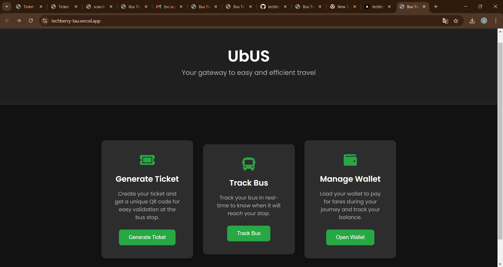
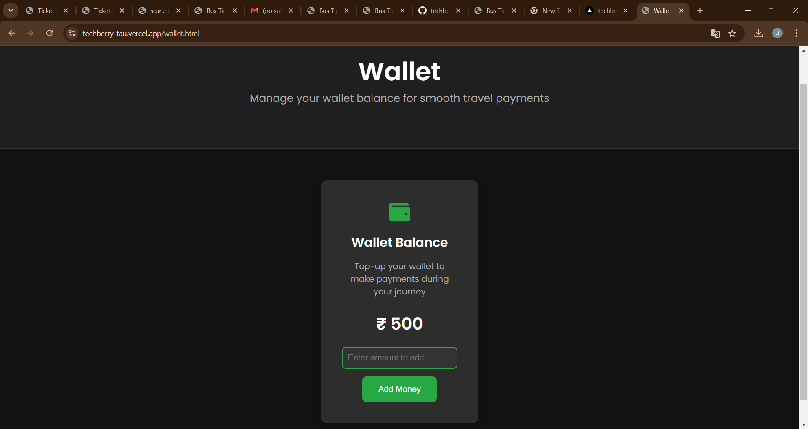
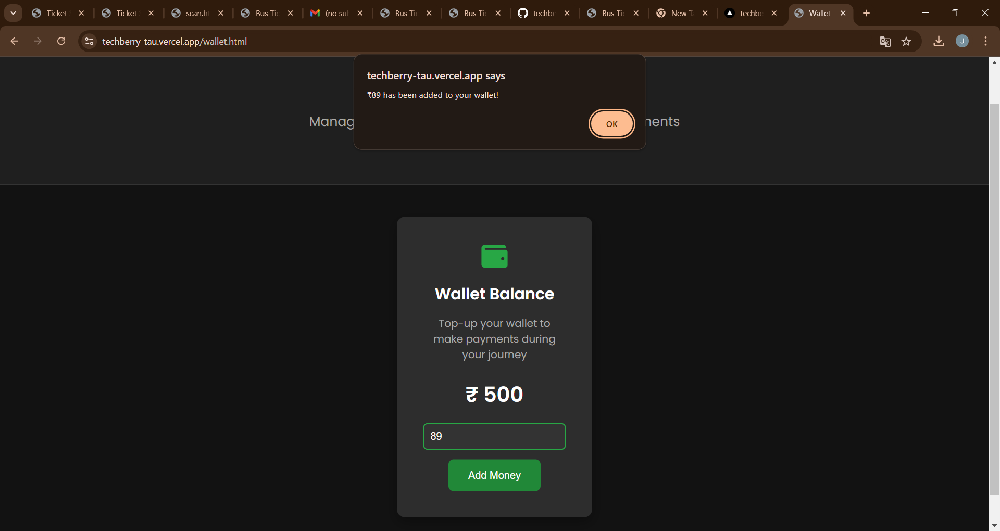
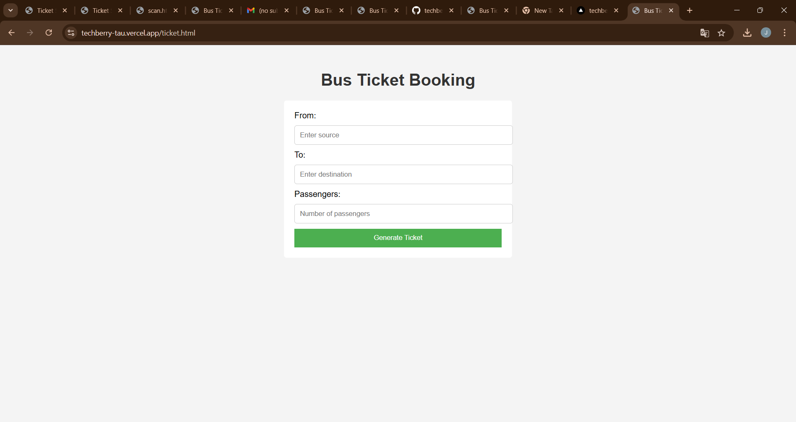
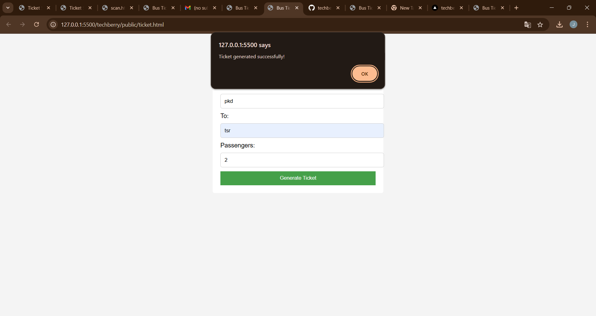
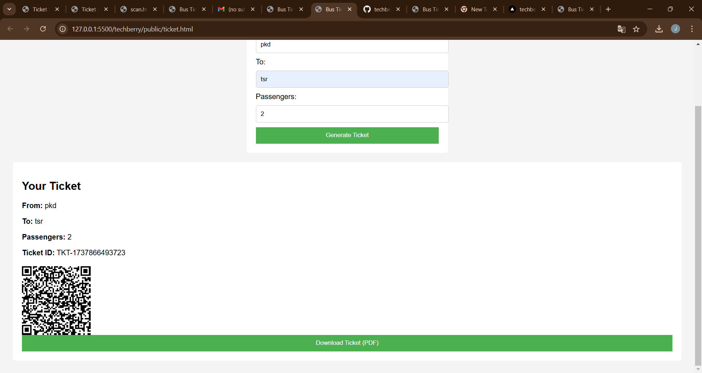
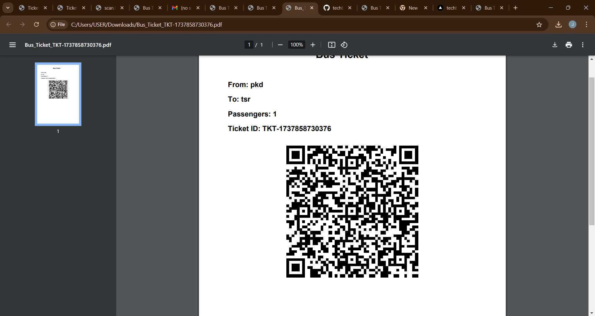

# UbUS
🎯

## Basic Details
### Team Name: techberry

### Team Members
- Member 1: [Jemsheena M] - [GEC PALAKKAD]
- Member 2: [RANJIMA K] - [GEC PALAKKAD]
- Member 3: [FATHIMA A] - [GEC PALAKKAD]

### Hosted Project Link
https://vercel.com/jemsheena-ms-projects/techberry/Dv5SaaQzrtAHSbvZeP7zpnz3sfjr

### Project Description
Managing crowds at bus stops and ensuring that passengers enter and exit in an organized manner is a significant challenge. During peak hours, overcrowding, unauthorized travel, and mismanagement of passenger flow often lead to inefficiency, security risks, and revenue losses for transportation services. A robust and automated system is needed to regulate entry and exit, prevent unauthorized access, and streamline the ticketing process.

### The Problem statement
Traditional bus ticketing systems often cause long waiting times for passengers. People typically stand in queues to buy tickets, which can be both time-consuming and frustrating. Moreover, there is no easy way to track or verify if passengers have valid tickets after they board the bus, leading to potential fare evasion.

### The Solution
The U BUS system eliminates the need for physical tickets and long queues. By using QR codes, passengers can instantly generate tickets directly from their mobile devices. The system calculates the fare based on the user's current location and destination, making the process faster and more transparent. Additionally, by scanning the exit QR code at the destination, passengers' entries and exits are validated, ensuring that only ticketed passengers board and exit the bus.

## Technical Details
### Technologies/Components Used
For Software:
- Languages used: HTML, CSS, JavaScript
- Frameworks used: Node.js
- Libraries used: QRCode
- Tools used: Visual Studio Code, GitHub 

For Hardware:
- List main components: QR scanners, server for hosting the website
- List specifications:
- List tools required
### Implementation
For Software:
# Installation

1. *Clone the Repository*  
   To clone the repository to your local machine, open your terminal or command prompt and run the following command:
   bash
   git clone https://github.com/jemsheena/techberry.git

2. **Install Dependencies**
    cd your-project-name
    npm install

3. **Get the HERE API Key**
    apikey: 'W2mJ6BrjiNpUisGOdNK8JYya7jeYRGBvdzrJYO9QUw' 

# Run
    #### Run

    After completing the installation steps, follow these instructions to run the project:

1. **Run Using a Local Server** (Recommended)

   If you're using a local server like `http-server`, navigate to the project directory in your terminal and run the following command to start the server:
   bash
   http-server .  # This starts the server on http://localhost:8080

   
### Project Documentation
For Software:

# Screenshots (Add at least 3)
## Screenshots

The homepage of the application showing the main interface.

*Add caption explaining what this shows*

*Add caption explaining what this shows*

*Add caption explaining what this shows*

*Add caption explaining what this shows*

*Add caption explaining what this shows*

*Add caption explaining what this shows*

# Diagrams

*Add caption explaining your workflow*

For Hardware:

# Schematic & Circuit

*Add caption explaining connections*

*Add caption explaining the schematic*

# Build Photos

*List out all components shown*

*Explain the build steps*

*Explain the final build*

### Project Demo
# Video
[Add your demo video link here]
*Explain what the video demonstrates*

# Additional Demos
[Add any extra demo materials/links]

## Team Contributions
- Jemsheena M:idea building,backend
- Ranjima K:project building,frontend
- Fathima A: System architecture design, testing,deployment

---
Made with ❤️ at TinkerHub

